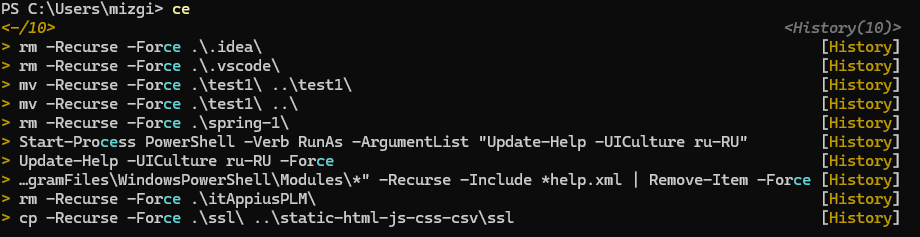

# devops

## Профили

### PowerShell

Профиль PowerShell по умолчанию находится в следующем расположении:

Основной профиль текущего пользователя
```text
$PROFILE

# Или полный путь:
C:\Users\[ИмяПользователя]\Documents\PowerShell\Microsoft.PowerShell_profile.ps1
```

Различные типы профилей:

1. Текущий пользователь, текущий хост (самый используемый)
```powershell
$PROFILE.CurrentUserCurrentHost
# C:\Users\[Username]\Documents\PowerShell\Microsoft.PowerShell_profile.ps1
```
2. Все пользователи, текущий хост
```powershell
$PROFILE.AllUsersCurrentHost
# C:\Windows\System32\WindowsPowerShell\v1.0\Microsoft.PowerShell_profile.ps1
```
3. Текущий пользователь, все хосты
```powershell
$PROFILE.CurrentUserAllHosts
# C:\Users\[Username]\Documents\Profile.ps1
```
4. Все пользователи, все хосты
```powershell
$PROFILE.AllUsersAllHosts
# C:\Windows\System32\WindowsPowerShell\v1.0\Profile.ps1
```

Проверка существования профиля:
```powershell
Test-Path $PROFILE
```

Создание профиля если не существует:
```powershell
if (!(Test-Path $PROFILE)) {
    New-Item -Path $PROFILE -Type File -Force
}
```

[Microsoft.PowerShell_profile.ps1](win/Microsoft.PowerShell_profile.ps1):

- функция 'Set-PowerShellTheme': Настройка внешнего вида

- установка alias'ов: 'which', 'open'
- функции быстрой навигации:
    -  '..' - аналог 'cd ..',
    -  '...' - аналог 'cd ..\\..',
    -  '~' - аналог 'cd ~' Linux,
    -  'proj' - goto Projects folder,
    -  'projj' - goto JAVA projects folder,
    -  'proj1c' - goto 1C projects folder,
    -  'projgo' - goto GO projects folder,
    -  'projrust' - goto RUST projects folder,
    -  'projdocker' - goto DOCKER projects folder,
    -  'projai' - goto AI projects folder,
    -  'docs' - goto User Documents folder,
    -  'downloads' - goto User Downloads folder,
    -  'credo' - goto Credo folder,
    -  'mymsoft' - goto mymsoft folder,
    -  'moek' - goto MOEK folder,
- функция 'la': аналог 'ls --color=yes -hAlF --group-directories-first' Linux
- функция 'touch': аналог 'touch' Linux
- функция 'search-history': Поиск в истории команд
- функция 'refresh': Перезапустить профиль
- функция 'sysinfo': Информация о системе
- функция 'Show-Welcome': Приветственное сообщение
- функция 'start_ssh': Проверка работы ssh-agent; удаление всех ключей; добавление ключей - github и gitlab

### BASH

